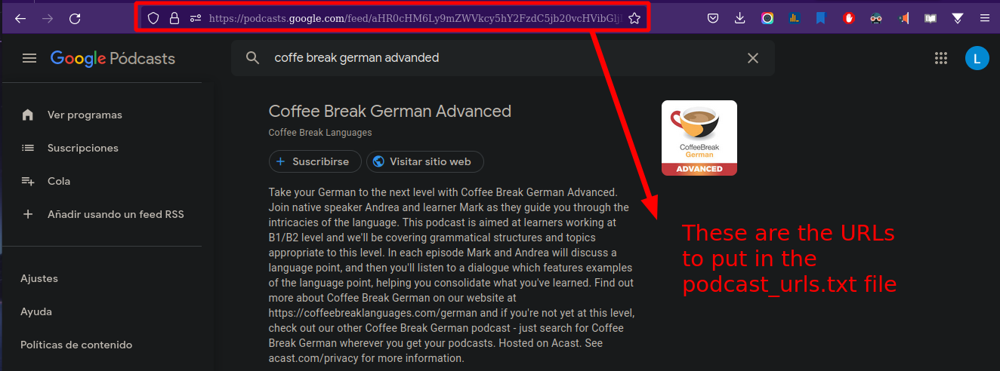
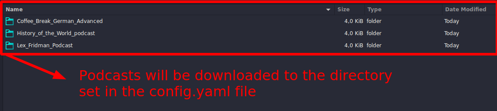
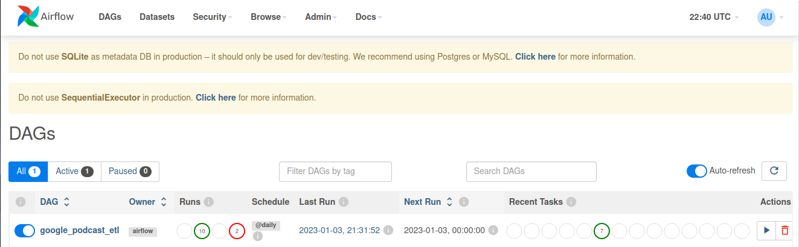
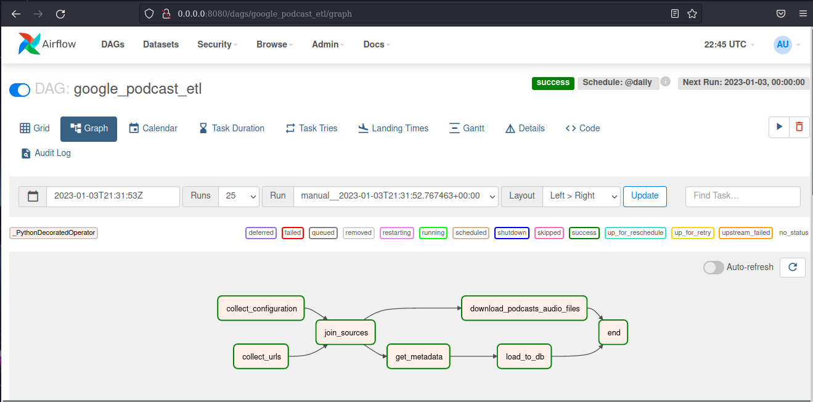

# Google Podcast Download Pipeline

## Description
This is a straightforward ETL Process to download podcasts from [Google Podcasts](https://podcasts.google.com/). The project started as a basic Jupyter Notebook but has been further improved to be a fully automated [Airflow](https://airflow.apache.org/) pipeline that can run on a schedule.  
The project reads podcast URLs from a [text file](podcast_urls.txt) and one-by-one scrapes the sites for both the audio file and metadata about the podcast. The metadata is stored to a local SQLite database that gets updated every time the pipeline is run. The audio files are downloaded to a directory of choice. Additional configurations parameters are found in the [configuration](config.yaml) file.

## Running the Pipeline as a Jupyter Notebook

- Step 1: Modify the [URLs](podcast_urls.txt) file adding the podcasts you are suscribed to.
- Step 2: Modify the [configuration](config.yam) file to set the destination directory for the audio files as well as how many days prior to the present should podcasts be scraped.
- Step 3: Run the entire [Notebook](notebook_version.ipynb).

## Running the Pipeline using Apache Airflow

Appended on this repo is the [Airflow DAG](DAG.py) file with everything set up to run the pipeline on a daily schedule. Use your preferred [setup](https://airflow.apache.org/docs/apache-airflow/stable/start.html) to run the pipeline. The configuration parameters are the same as for the Notebook.

